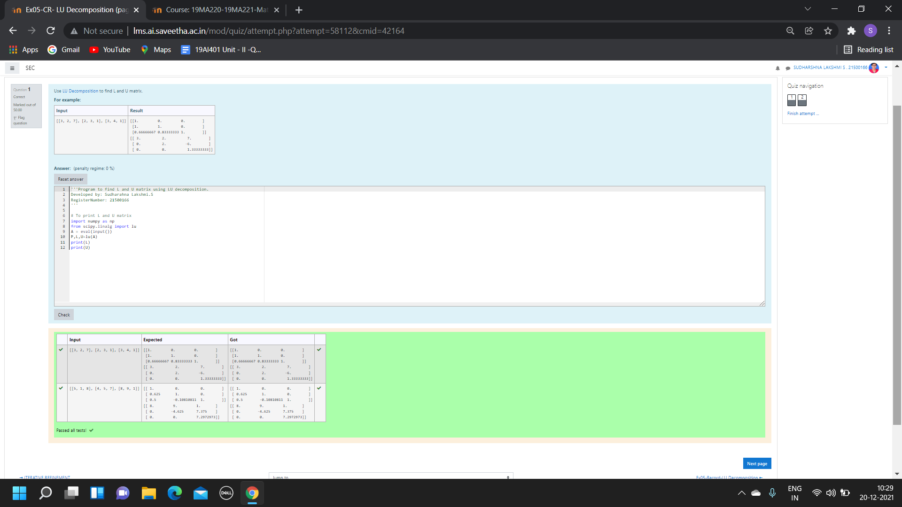
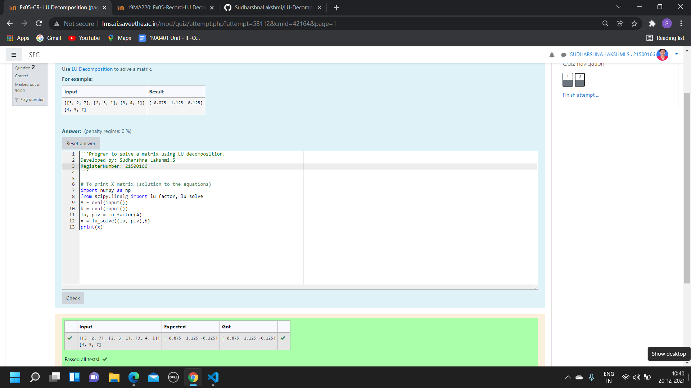

# LU Decomposition without zero on the diagonal

## AIM:
To write a program to find the LU Decomposition of a matrix.

## Equipments Required:
1. Hardware – PCs
2. Anaconda – Python 3.7 Installation / Moodle-Code Runner

## Algorithm
1. import numpy as np.
2. from scipy.linalg import lu, lu_factor, lu_solve.
3. solve using scipy.linalg.lu(variable)
4. print the output.

## Program:

```
'''Program to find L and U matrix using LU decomposition.
Developed by: Sudharahna Lakshmi.S
RegisterNumber: 21500166
'''

# To print L and U matrix
import numpy as np
from scipy.linalg import lu
A = eval(input())
P,L,U=lu(A)
print(L)
print(U)
```

```
'''Program to solve a matrix using LU decomposition.
Developed by: Sudharshna Lakshmi.S
RegisterNumber: 21500166
'''

# To print X matrix (solution to the equations)
import numpy as np
from scipy.linalg import lu_factor, lu_solve
A = eval(input())
b = eval(input())
lu, piv = lu_factor(A)
x = lu_solve((lu, piv),b)
print(x)

```

## Output:

### Program to find L and U matrix using LU decomposition:



### Program to solve a matrix using LU decomposition:




## Result:
Thus the program to find the LU Decomposition of a matrix is written and verified using python programming.

